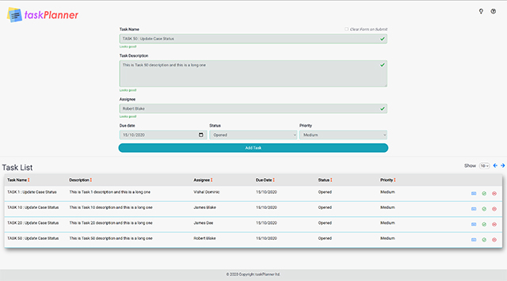
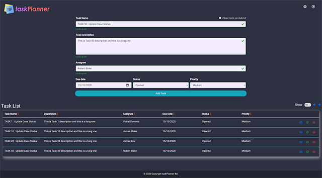

# taskPlanner
> TaskPlanner is a simple ToDo list application that has been built using HTML, CSS and JS.

# Table of contents
* [General info](#general-info)
* [Screenshots](#screenshots)
* [Technologies](#technologies)
* [Features](#features)
* [Status](#status)
* [Issues](#issues)
* [Inspiration](#inspiration)
* [Contact](#contact)
* [License](#license)

# General info
The taskPlanner has been build to have a clean user interface with a ministic theme in mind.
The application focuses on user being able to input and view relevant information in a consise and systametic manner.

# Screenshots
Light Mode

Dark Mode

# Technologies
* Bootstrap - version 4.5.2
* Font Awesome Library
* Google fonts

# Features
Following are the main highlights of the application.
* Supports basic features such as "Add Task", "Delete Task" and "Edit Task".
* Validation on all input field.
* Validation on date picker field.
* Support for "Clear on Submit" checkbox when adding task. 
* Sortable Task List view.
* Tooltips enabled for all buttons and fields.
* Dark Mode theme switcher.

# Status
Project is: _in progress and bug fixes pending_

# Issues
* Known issue with Form Validation on Edit button click
* Add more tests

# Inspiration
Project is inspired by application such as [Trello](https://trello.com/en) and [TodoList](https://todoist.com/home)

# Contact
Created by:
* [Juliana Tio](mailto:juliana.tio122@gmail.com) - feel free to contact me!
* [Vishal Dominic](mailto:vizpal@gmail.com) - feel free to contact me!

# License
APACHE 2.0
